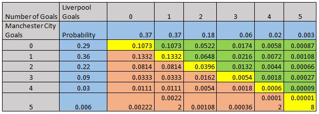

<!-- PROJECT LOGO -->
<br />
<p align="center">
  <a href="https://github.com/othneildrew/Best-README-Template">
    
  </a>

  <h3 align="center">Football League Predictions</h3>

  <p align="center">
    An awesome project on Poisson distribution!
    <br />
    <a href="https://footballprediction.netlify.app/"><strong>Explore the Demo »</strong></a>
    <br />
    <br />
   
  </p>
</p>


<!-- ABOUT THE PROJECT -->
## About The Project


As one of the most popular sports on the planet, football has always been followed very closely by a large number of people. In recent years, new types of data have been collected for many games in various countries, such as play-by-play data including information on each shot or pass made in a match.

We developed an ’expected goals’ metric which helps us evaluate a team’s performance, instead of using the actual number of goals scored. We combined this metric with a calculation of a team’s offensive and defensive ratings which are updated after each game and used to build a classification model predicting the outcome of future matches, as well as a regression model predicting the score of future games.

## Problem Statement
* Large inconsistencies in many games between a team’s performance and number of goals scored or conceded
* Many techniques predict outcome using number of goals --- which is a random element
* We will explore different model design hypotheses and assess our models’ performance against benchmark techniques :smile:

Combining two popular and modern prediction methods, namely an expected goals model as well as attacking and defensive team ratings. A successful outcome for the project would be the creation of both a classification model capable of predicting a future game’s outcome, and a regression model capable of predicting a future game’s score.

## Calculating Football Results

### Goal Expectancy 
Your team's goal expectancy depends on your team’s attack strength and defence strength, and as well as that of the opposite team.
### Poisson distribution
The Poisson distribution is commonly used to calculate the likelihood of a specific score in football, as well as a win, lose or draw.
Lets consider a hypothetical match between Man. City and Liverpool FC.


## Before calculating

We need to know:
* The total home goals scored by all EPL teams
* The total away goals scored by all EPL teams
* The average number of home goals and away goals per match for the whole league

Calculate Manchester City’s
* Home goal average
* Average goals allowed per home match

Calculate Liverpool’s
* Away goal average
* Average goals allowed per away match

In our example, we will use the data from the 2018-2019 English Premier League to calculate a hypothetical match.


**Calculating Attack Strength**<br />
With these results, we can easily calculate attack strength for the home and away team. Attack Strength is the team’s average number of goals, divided by the league’s Average number of goals.<br />
**Home**<br />
Manchester City’s Attack Strength: 3.00 ÷ 1.53 = 1.96<br />
**Away**<br />
Liverpool’s Attack Strength: 1.78 ÷ 1.147 = 1.55<br />

**Calculating Defence Strength**<br />
Calculating Defence Strength is just as easy. Simply divide the team’s average number of goals allowed by the league’s average number of goals allowed.<br />
**Home**<br />
Manchester City’s Attack Strength: 0.63 ÷ 1.147 = 0.55<br />
**Away**<br />
Liverpool’s Attack Strength: 0.63 ÷ 1.532 = 0.41<br />

**Goal expectancy**<br />
Now that we have determined each team’s Attack Strength and Defence Strength, we can calculate each team’s likely score.<br />
**Manchester City goal expectancy**<br />
To determine how many goals Manchester City will likely score, we need to multiply Manchester City’s Attack Strength by Liverpool’s Defence Strength and the league’s average number of home goals.<br />
That gives us:<br />
1.96 × 0.41 × 1.532 = 1.23<br />

**Liverpool goal expectancy**<br />
To determine how many goals Liverpool will likely score, we need to multiply Liverpool’s Attack Strength by Manchester City’s Defence Strength and the league’s average number of away goals.<br />
That gives us:<br />
1.55 × 0.55 × 1.147 = 0.997<br />

Average goals scored in the match<br />
**Manchester City**: 1.23<br />
**Liverpool**: 0.997<br />

**Using the Poisson Formula to calculate the likelihood of each possible score**<br />
Now that we have each team’s home and away defence and attack strengths, we can easily use them with the Poisson formula to calculate the probability of any possible outcome.<br />
The Poisson Formula<br />
**P (k events in interval) = (λk e –λ) / k! <br />
In this formula:**<br />
**P** is the probability<br />
**k** is the number of occurrences in the interval (number of goals)<br />
**λ** is the expected number of goals<br />
**e** is Euler's number (e = 2.71828…)<br />
**k!** is the factorial of k<br />
<pre>
<b>That gives us the following probability for Manchester City Goals:</b><br />
<b>Man. City Goals</b>    | 0          | 1         | 2         |3          |4           |5         | <br /> 
<b>Probability</b>        | 0.29229258 |0.35951987 |0.22110472 |0.09065294 |0.02787578  |0.00685744| <br />

<b>That gives us the following probability for Liverpool Goals:</b><br />
<b>Liverpool Goals</b>    | 0          | 1         | 2         |3          |4          |5         |  <br />
<b>Probability</b>        | 0.36898474 |0.36787778 |0.18338707 |0.06094564 |0.0151907  |0.00302903|  <br />
</pre>

**Predicting the match outcome based on these probabilities**<br />
To get each possible score, simply multiply the probability of each possible score by each team by the probability of each possible score by the other team. This gives you the following distribution:<br />
<br />
As you can see, the most likely score is 1 – 1, or 1 – 0 followed by 0 – 0 or 0 – 1. Given the defence averages of both teams, it is easy to see how these would be very likely scores.<br />

### Getting Started

This is an example of how to list resources and calculate probability.
* Getting some data
  ```import pandas as pd
  import matplotlib.pyplot as plt
  import numpy as np
  import seaborn
  from scipy.stats import poisson,skellam
  
  epl_1819 = pd.read_csv("http://www.football-data.co.uk/mmz4281/1819/E0.csv")
  epl_1819 = epl_1819[['HomeTeam','AwayTeam','FTHG','FTAG']]
  epl_1819 = epl_1819.rename(columns={'FTHG': 'homeGoals', 'FTAG': 'AwayGoals'})
  ```
* Truncate data to reduce the search space
  ```epl_1819_master = epl_1819
  epl_1819_test = epl_1819[[-10:]
  epl_1819 = epl_1819[:-10]
  epl_1819.mean()
  ```
* Max goals (Home and Away)
  ```
  epl_1819[['HomeGoals','AwayGoals']].max()
  ```
  
* Chances of a Home team scoring 1 goal
  ```
  poisson.pmf(1,1.575676)
  ```

### Conclusion
Our main objective of building an expected goals model by exploring different Machine Learning techniques has been accomplished. Indeed, we successfully implemented modern Machine Learning algorithms such as ‘Poisson’s Distribution’ techniques to generate match outcome and match score predictions. We managed to find and improve a database containing enough information to generate expected goals metrics, through both shots and other in-game statistics, and team ratings. We have also compared our predictions to benchmark methods in order to better understand our models’ predictive performance.The top four teams qualify for next season’s UEFA Champions League. The bottom three teams are relegated.<br />
<a href="https://data.fivethirtyeight.com/#soccer-spi">Download this data.</a>
<br />
<br />
<br />

Design and development by <a href="https://rohitsingh.netlify.app/">Rohit Singh</a> and <a href="https://boro-blogs.netlify.app/">Sintu Boro</a>
